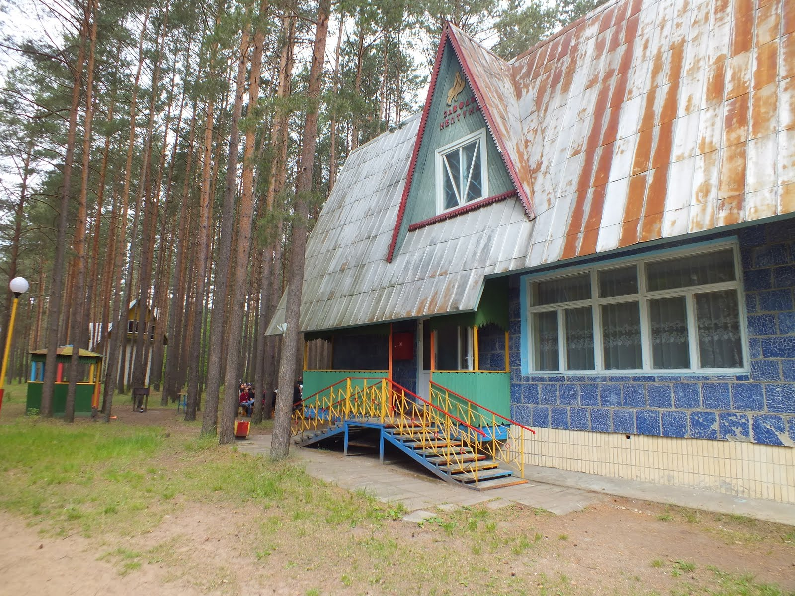
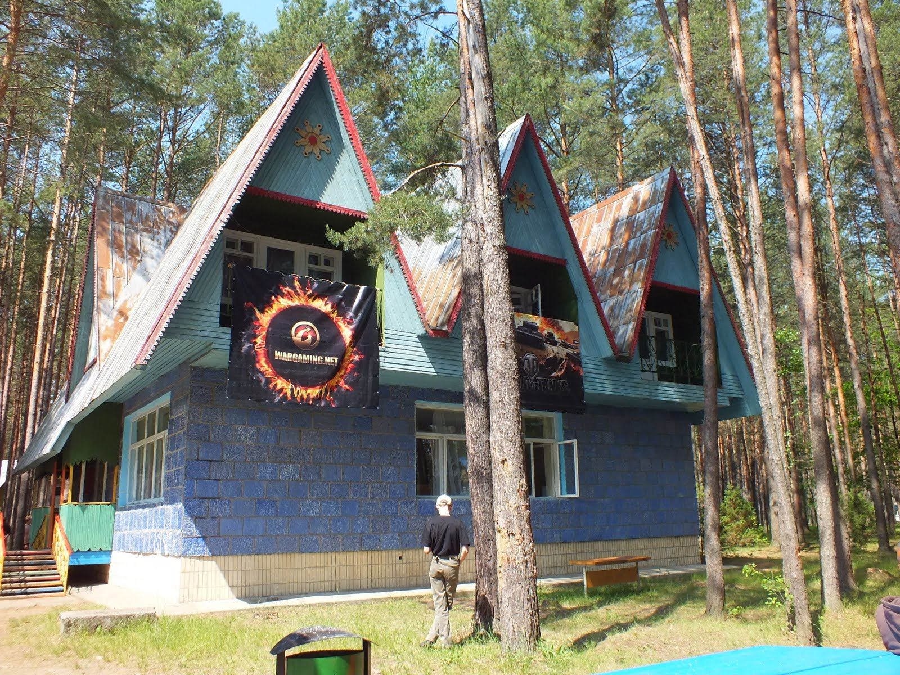
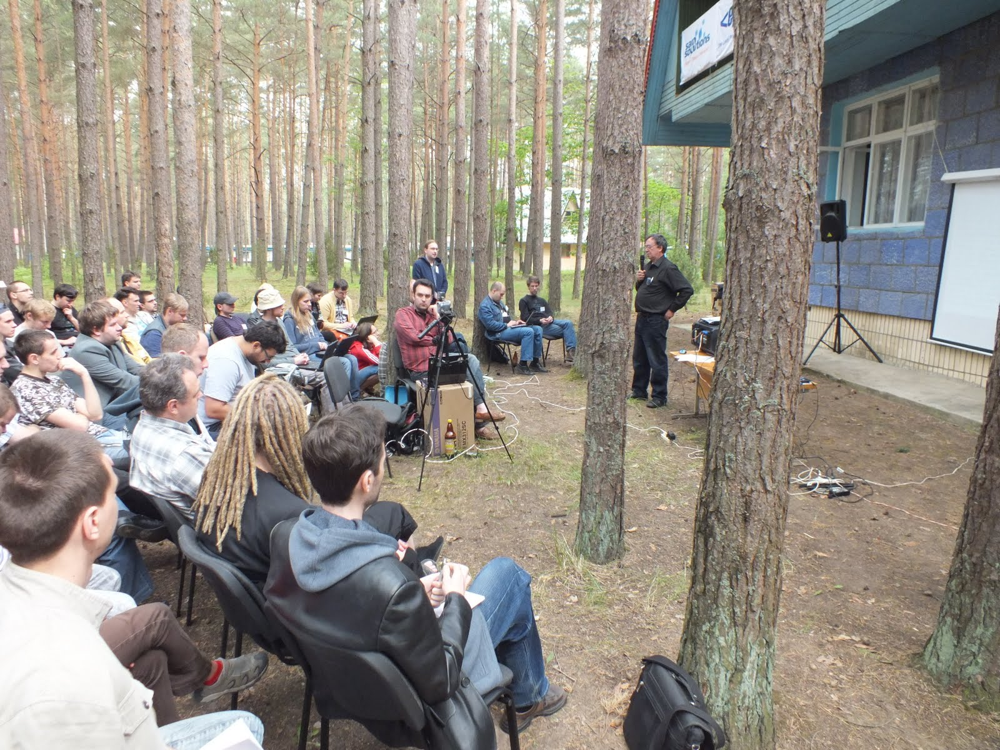
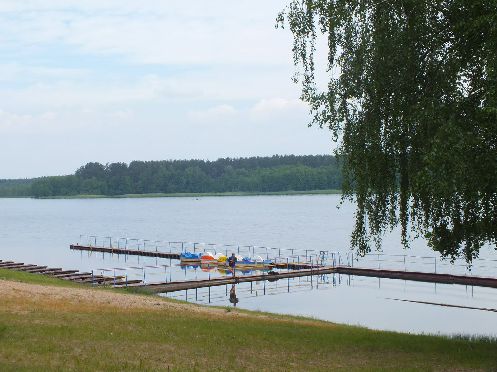

On Friday, I will be attending [LVEE](https://lvee.org/) (Linux Vacation Eastern Europe) once again after a few years of missing it for various reasons. I will be presenting a talk on my experience of working with [LAVA](https://validation.linaro.org/); the talk is based on a talk given by my colleague [Guillaume Tucker](https://gtucker.io/), who helped me a lot when I was ramping up on LAVA.

Since the conference is not well known outside, well, a part of Eastern Europe, I decided I need to write a bit on it. According to the organisers, they had the idea of having a Linux conference after the newly reborn [Minsk Linux User Group](https://mlug.linux.by/) organised quite a successful celebration of the ten years anniversary of Debian, and they wanted to have even a bigger event. The first LVEE took place in 2005 in a middle of a forest near [Hrodna](https://en.wikipedia.org/wiki/Hrodna).



As the name suggests, this conference is quite different from many other conferences, and it is actually a bit close in spirit to the [Linux Bier Wanderung](https://linuxbierwanderung.com/about.html). The conference is very informal, it happens basically in a middle of nowhere (until 2010, the Internet connection was very slow and unreliable or absent), and there’s a massive evening programme every evening with beer, [shashlyk](https://en.wikipedia.org/wiki/Shashlyk) and a lot of chatting.

My first LVEE was in 2009, and it was, in fact, my first Linux conference. The venue for LVEE has traditionally been a tourist camp in a forest. For those unfamiliar with the concept, a tourist camp (at least in the post-Soviet countries) is an accommodation facility usually providing a bare minimum comfort; people are normally staying in huts or small houses with shared facilities, often located outside.

When the weather permits (which usually is defined as: *not raining*), talks are usually held outside. When it starts raining, they move inside one of the houses which is big enough to accommodate most of the people interested in talks.

Some participants prefer to stay in tents:

People not interested in talks organise *impromptu* open-air hacklabs:

Or take a swim in a lake:

Of course, each conference day is followed by shashlyks and beer:

And, on the final day of the conference, cake!

This year, for the first time LVEE is being sponsored by [Collabora](https://collabora.co.uk/) and Red Hat.

The talks are usually in Russian (with slides usually being in English), but even if you don’t speak Russian and want to attend, fear not: most of the participants speak English to some degree, so you will unlikely feel isolated. If enough English-speaking participants sign up, it is possible that we can organise some aids (e.g. translated subtitles) to make both people not speaking English and not speaking Russian feel at home.

I hope to see some of the readers at LVEE next time :)
