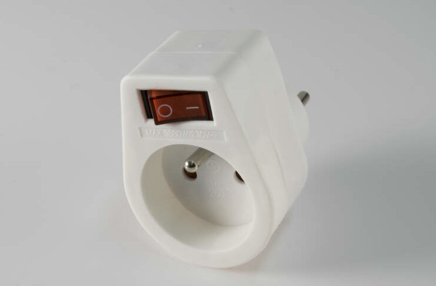

Two weeks ago I decided to make myself a combined birthday and Christmas present and upgrade my coffee gear.

I’ve got my first espresso machine back in 2013, it was a cheap Saeco Philips Poemia, which made reasonably
drinkable coffee, but not being able to make good coffee made me increasingly unhappy about it. However,
since it worked, I wasn’t motivated enough to change anything — until it stopped working. One day the nut holding
the ‘shower screen’ broke, and I couldn’t replace it.

Having no coffee machine is arguably worse than having a mediocre one, so I started looking for a new one in the budget
range. Having spent about two months reading reviews for all sorts of manual espresso machines, I realised the best
thing I can probably do for the money I was willing to spend at the time was to buy a second-hand Gaggia Classic.
Which is what I did: I paid €260 to a person who apparently decided they prefer to press a button to get their espresso
rather than have to prepare it themselves.

My first attempts at making espresso weren’t very much successful, as my hand grinder couldn’t produce the right grind for
espresso (without using pressurised baskets), so I quickly upgraded it to the €50 De’Longhi electric grinder, which was much
better for espresso.



This setup has worked for me for nearly 4 years, but over the time the Gaggia started malfunctioning.

See, this particular Gaggia Classic is the 2015 model, which resulted in the overhaul of the design after Gaggia was acquired by
Philips. They replaced the boiler, changed the exterior design a bit, and — importantly for me — replaced the fully metal group
head with the metal and plastic version typically found in cheap espresso machines like my old Poemia.



The trouble with this one is that the plastic bit (barely seen on the picture, but it’s inserted into the notches on the sides
of the group head) is that it gets damaged over the time, especially when the portafilter is inserted very tightly. The more
damaged it gets, the tigher it is necessary to insert the portafilter to avoid leakage, the more damaged it gets and so on.

At one point, the Gaggia was leaking water every time I was making coffee, affecting the quality of the brew and making a mess
in the kitchen. I made a mistake and removed the plastic bit only to realise it cannot be purchased separately and nobody knows
how to put it back once it’s been removed; I ended up paying more than a hundred euro to replace the group head as a whole.

Once I’ve got the Gaggia back, I became too conscious of the potential damage I can make by overengaging the portafilter, I decided
it’s probably the time to get a new coffee machine.



The makers of Gaggia listened to the critics and undid the 2015 changes to the Gaggia Classic design, reverting to the previous one
and fixing it — they basically ‘merged’ the fixes many of the owners of the old Gaggia did themselves. The group head is now without
any plastic, so I don’t have to worry that much about damaging it accidentally.

A friend pointed out that my grinder is probably not good enough and recommended a couple of models to me; I checked
[Kev’s Coffee Blog](https://coffeeblog.co.uk/best-budget-electric-burr-coffee-grinders-in-the-uk/) and found a grinder, Sage Dose Control Pro,
which was available on sale in my local shop for a reasonable price.

I’ve also got a portafilter holder to make tamping more comfortable — I used to tamp against an edge of the sink:


The final setup:


What I learnt from this is that the grinder does indeed make a huge difference. I am now able to consistently produce brews I would only occasionally
get with the old De’Longhi grinder. There is one downside to the new grinder.

Happy with my new purchase, I went to read this review and thought to myself: ‘lucky me, my grinder is absolutely quiet!’ And then I realised that
the noise in my kitchen is not, in fact, produced by the fridge, but the grinder. Well, a cheap switched plug solved the issue completely (I wish
sockets here each had a switch like they usually do in the UK!)

